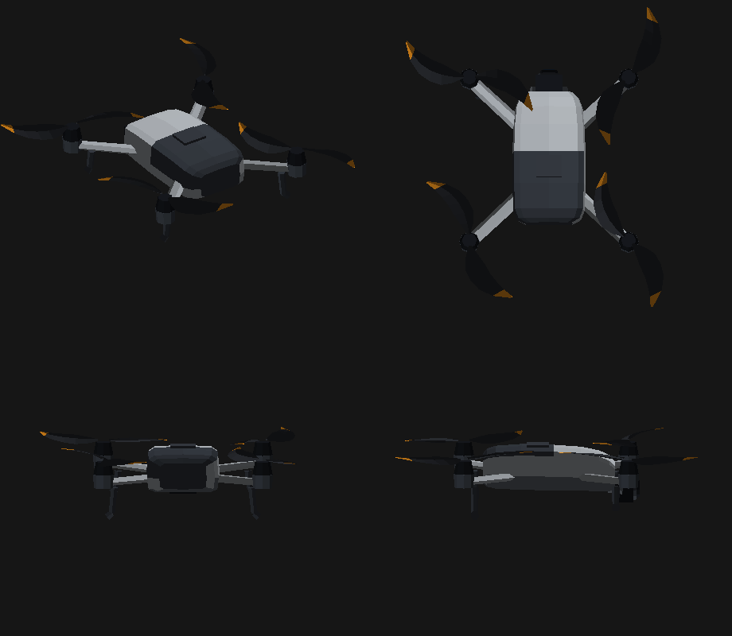

# Open Flight Planner

Browser-based waypoint planner for DJI drones. Plans a survey, follows the
terrain, and exports a `.kmz` that **DJI Fly and DJI Pilot 2 accept directly** —
no conversion step, no cloud account, no subscription.

Everything runs in the browser. Your routes never leave the machine.

> **Status: not yet flown.** The exporters are built against real KMZ files and
> covered by 780 tests, but no route produced by this tool has been flown on an
> aircraft yet. Read [what to verify in the field](docs/verificar-no-campo.md)
> before you trust it with a battery. If you fly one, please open an issue —
> that single report is the most useful contribution this project can get.

*The interface and the source comments are in European Portuguese.*

---

## The problem it solves

DJI ships **two incompatible waypoint formats** under the same `.kmz` extension:

| | namespace | used by |
|---|---|---|
| **Fly** | `uav.com/wpmz/1.0.2` | consumer aircraft, DJI Fly app |
| **Pilot 2** | `dji.com/wpmz/1.0.6` | enterprise aircraft, DJI Pilot 2 |

A file written for one is refused by the other. Most planners emit a single
dialect and leave you converting by hand, or push you to a subscription.

This one writes both, picked from the aircraft you selected.

## What it does

**Survey coverage from a parcel boundary.** Import the site perimeter as
KMZ/KML, and the coverage is generated from the camera and the altitude — a
photo at `h` metres with field of view `f` covers `2h·tan(f/2)` of ground. You
specify altitude and overlap, the way a survey is actually specified; the
spacing follows.

**Terrain following that means it.** Altitudes are AGL against a real elevation
model, with a terrain profile showing clearance along the whole route. On a
slope, constant AGL is the difference between a usable survey and a crash.

**Battery splitting.** Not the path divided by endurance — each leg is a whole
flight: climb, transit out, work, return. The further a leg sits from the
take-off point, the less time it has to work. Each leg becomes its own route.

**Virtual flight.** Fly the aircraft over the map with the keyboard and record
waypoints with the attitude you framed. The camera view shows what the lens
would see, and the 3D frustum shows where it is looking from.

**Validation before export.** Ground clearance, service ceiling, endurance,
speed limits, and actions the selected aircraft does not support.

Also: DXF topography import (ETRS89 / PT-TM06), flight replay up to 50×, route
repetition, measurement, KML export for Google Earth.

## The aircraft it knows

The numbers that decide whether an aircraft accepts a file — `droneEnumValue`,
`droneSubEnumValue`, `payloadEnumValue` — come from two places, and the
difference matters:

- **Enterprise line** — published in DJI's
  [Cloud API documentation](https://github.com/dji-sdk/Cloud-API-Doc/blob/master/docs/en/60.api-reference/00.dji-wpml/40.common-element.md).
  All of them are here: Mavic 3E/3T/3M, Matrice 30/30T, 3D/3TD, 300 RTK, 350 RTK.
- **Consumer line** — no published table exists. The Mini 5 Pro's values were
  read out of a real KMZ pulled from the aircraft. **Every other consumer model
  is missing**, because a guessed number does not produce an error — it produces
  a route that will not fly.

**This is where you can help most.** If you own a Mini, an Air, or any aircraft
not listed, export one waypoint mission from the app and open an issue with the
`droneEnumValue` from inside it. See [CONTRIBUTING](CONTRIBUTING.md).

## Running it

```bash
npm install
npm run dev
```

Build and preview a production bundle:

```bash
npm run build
npm run preview
```

Deploying to a static host is one step — see [docs/alojamento.md](docs/alojamento.md).

## How it is built

TypeScript, React 19, MapLibre GL, Dexie (IndexedDB). No backend.

The drone on the map is drawn in code — 1500 triangles, original geometry, built
from published dimensions. No third-party model is bundled.



```
npm test         780 unit and component tests
npm run e2e      3 end-to-end tests against a production build
npm run cobertura coverage report
npm run lint     oxlint, hooks rules
```

The end-to-end tests run against the **built** bundle on purpose: the two most
expensive defects in this project's history — a blank map, and a dead MapLibre
worker that left the terrain perfectly flat — only appeared once built.

## Honest limitations

- **Never flown.** See the status note above.
- Two Pilot 2 details — how `wpml:actionId` is numbered across groups, and
  whether `wpml:actionGroupId` may skip — are written from the public spec and
  await a real FlightHub 2 export to confirm.
- Three Fly action names (`hover`, `rotateYaw`, `zoom`) are unconfirmed. The app
  warns when a route uses one.
- Map tiles and elevation come from public services. No offline mode.

## Licence

[MIT](LICENSE). Not affiliated with, endorsed by, or connected to DJI. All
trademarks belong to their owners.
